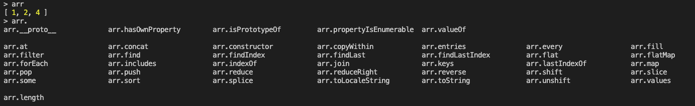
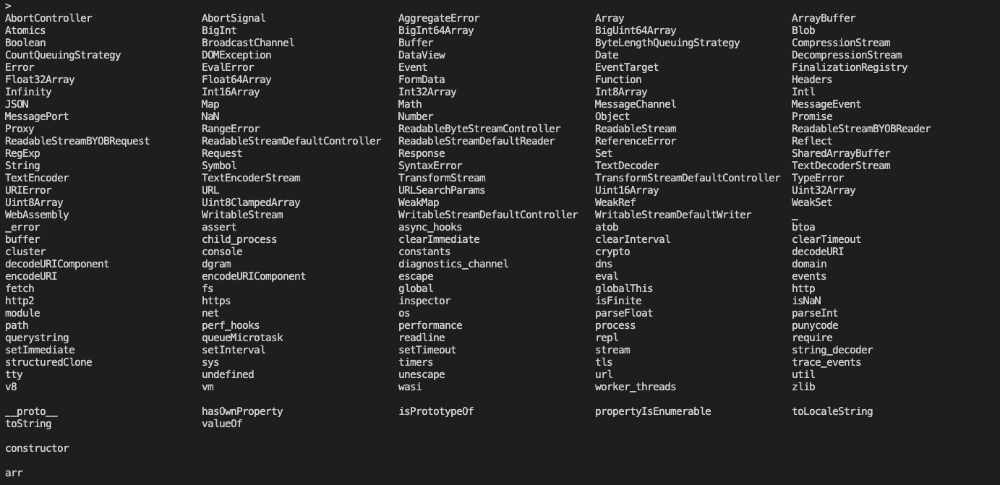

## The tab key

The driver of a very powerful feature ,the tab completion. It works in the node REPL. 

Double click on the tab key to see all possible options (keywords and functions).

Example: 

type `Array.` then double tab, then you see all the available methods available in this object.

```
const arr = [1, 2, 3, 5]
```

Then type `arr.` and double tab: 




Typing double tab, we see all objects, modules and classes that are globally available in node.



The built-in modules in node `http`, `fs`, `dns`, `cluster`. These are node powerful libraries that you get out of the box. Those module are directly avaialbe in REPL. However, when working with regular node scripts, we will have to import them in order for them to be used.


## Execute Node Script

```
> node <script_name.js>
```


